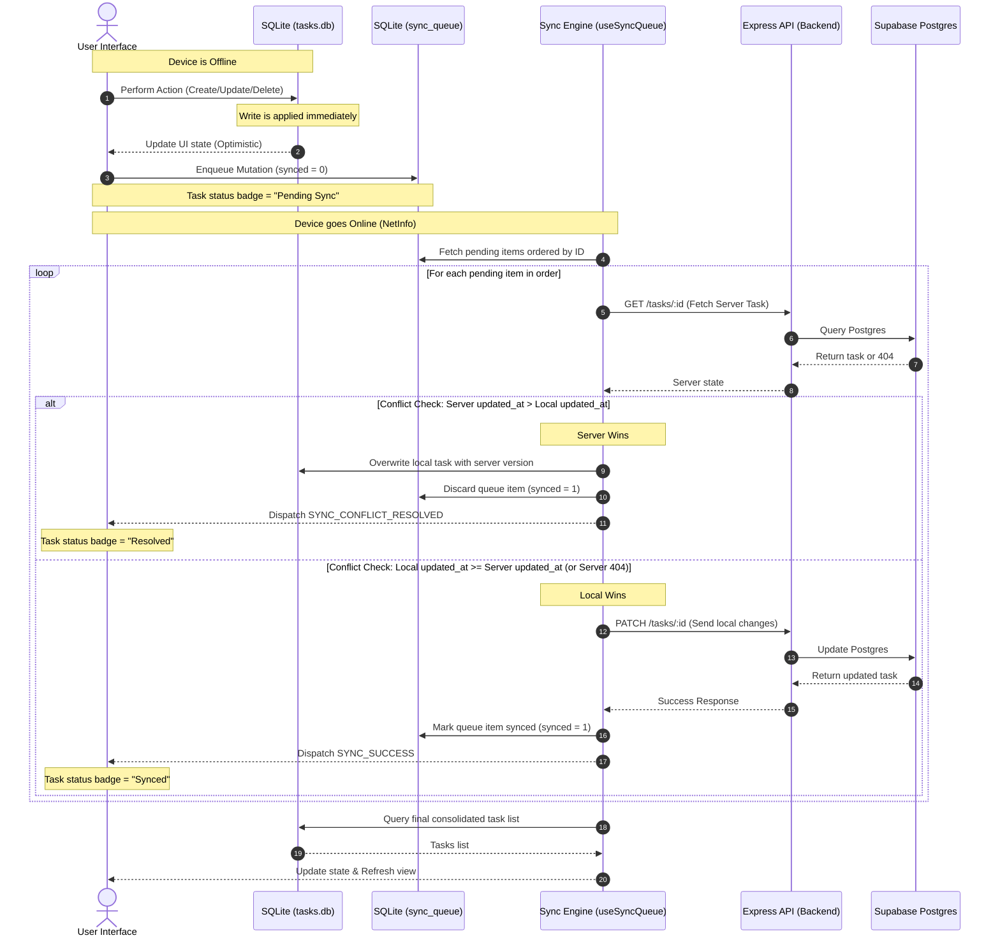

# System Architecture: Offline Sync & Conflict Resolution

This document describes the architectural flow, component relationships, and data synchronization engine of the Cross-Platform Task System.

---

## 🔄 End-to-End Synchronization Lifecycle

The system utilizes an offline-first architectural pattern: SQLite acts as the immediate write-store, and a background processor synchronizes changes to the Supabase database.

### Flow Step-by-Step

1. **Local Writes (Offline)**: When the user interacts with the app (e.g. toggles completion), the operation is applied immediately to the local SQLite database. The state reducer is immediately updated (`TasksContext`), resulting in instantaneous UI changes without showing any loading indicators.
2. **Queuing**: Simultaneously, a sync entry is pushed to the SQLite `sync_queue` table containing the action type (`create`, `update`, `delete`), the task ID, and the JSON payload representing the changes. The task's status in `SyncContext` is updated to `pending`.
3. **Reconnection**: The `useNetwork` hook monitors device connectivity. The moment connection is restored (or when a new write occurs while online), the `drainQueue` routine is triggered.
4. **Queue Drainage**: The Sync Engine locks itself, fetches all unsynced queue items sorted chronologically (`id ASC`), and processes them sequentially to preserve the order of user actions.
5. **Conflict Check**: For each item, the client fetches the server's task state (`GET /tasks/:id`).
   - If the server has a version with a newer `updated_at` timestamp, the server wins. The engine discards the local update and overwrites SQLite with the server's data.
   - Otherwise, the local version wins. The engine sends the update to the server (`PATCH /tasks/:id`) and updates SQLite with the server's confirmation.
6. **Persistence & Refresh**: Once the queue is fully drained, the tasks list in the Context is refreshed from SQLite, and the lock is released. If a network call fails, the transaction is aborted and remains in the queue for the next reconnect attempt.

---

## ⚖️ Conflict Resolution Strategy (Last-Write-Wins)

### Why Last-Write-Wins (LWW) was chosen
1. **Low Footprint**: Running queries on `expo-sqlite` and performing basic timestamp string comparisons requires no heavy dependencies or syncing frameworks, maintaining a lightweight app build.
2. **Deterministic**: Resolution is executed client-side based on timestamps, guaranteeing a single deterministic winner.
3. **Task Systems Context**: Task managers are rarely collaborative document editors; tasks are typically owned and updated by a single user. Complex merges are rarely necessary, making LWW the perfect pragmatic choice.

### Technical Trade-offs
- **Device Clock Dependence**: LWW relies on the client's local system time (`updated_at`). If a client's device clock is incorrect, their changes may either always win (if in the future) or always lose (if in the past).
- **Update Overwrites**: If two users modify different fields of the same task offline (e.g. User A updates the description, User B updates the due date), the final sync will discard one entire update, rather than merging the changes.

---

## 📌 Architectural Assumptions
- **Public Sandbox**: Suppabase Row Level Security (RLS) is enabled but configured with a basic policy allowing all operations. For a multi-user production build, tasks must link to an authenticated `user_id` and have RLS policies restrict operations to `auth.uid() = user_id`.
- **Single-device or Low Collaboration**: The database is structured assuming that conflicts are sporadic, rather than continuous.
